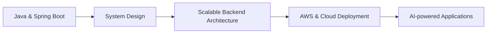

<div align="center">


<a href="https://linkedin.com/in/openit">
  
</a>
<a href="https://github.com/AnmolTwari">
  
</a>
<a href="mailto:anmoltiwari621@gmail.com">
  
</a>
<a href="https://iamanmol.vercel.app">
  
</a>

<br/><br/>

<a href="https://github.com/AnmolTwari">
  
</a>


</div>

---

## 🚀 About Me

I'm a **Java Full Stack Developer** focused on building secure, scalable, and maintainable web applications.

```yaml
name: Anmol Tiwari
role: Java Full Stack Developer
focus: [Spring Boot, Spring Security, Angular, React]
interests: [REST APIs, JWT, OAuth2, RBAC, System Design]
databases: [MySQL, PostgreSQL, MongoDB]
cloud: [AWS]
currently_exploring: AI-powered applications
fun_fact: "☕ Turns coffee into commits"
```

---

## 🛠️ Tech Stack

<div align="center">

### Backend


### Frontend


### Databases


### Tools & Cloud


</div>

---

## ⭐ Featured Projects

<details open>
<summary><b>🏪 ShopManager — Full-stack business management platform</b></summary>
<br/>

Built for small shop owners to manage inventory, sales, and reporting.

- 📦 Product and inventory management
- 💰 Sales and reporting workflows
- 🔐 JWT authentication with Spring Security
- 🏢 Multi-tenant data isolation
- 🧪 46 backend tests
- ⚛️ React frontend · ☕ Spring Boot backend · 🐘 PostgreSQL database

`Java` `Spring Boot` `React` `PostgreSQL` `Spring Security` `JWT`

</details>

<details>
<summary><b>📁 Enterprise File Management System — Mphasis Internship Project</b></summary>
<br/>

Role-based enterprise file management platform.

- 🔐 JWT Authentication
- 🔑 Google OAuth2
- 👥 Role-Based Access Control
- 🔗 12+ RESTful APIs
- 🗄️ Spring Data JPA & Hibernate
- 📊 Audit logging
- 🏗️ Controller-Service-Repository architecture

`Java 21` `Spring Boot` `Angular 17` `MySQL` `Spring Security`

</details>

<details>
<summary><b>🤖 ResuMatch AI — AI-assisted Applicant Tracking System</b></summary>
<br/>

Helps recruiters parse resumes and manage candidates efficiently.

- 📄 Resume parsing
- 👨‍💼 Recruiter dashboard
- 🔐 JWT authentication
- ⚡ FastAPI backend
- ⚛️ React + TypeScript frontend
- 🐘 PostgreSQL database

`React` `TypeScript` `FastAPI` `Python` `PostgreSQL`

</details>

---

## 📊 GitHub Stats

<div align="center">


</div>

---

## 🐍 Contribution Snake

<div align="center">


<sub>⚙️ Add the <a href="https://github.com/Platane/snk">Platane/snk</a> GitHub Action to your repo to auto-generate this animation daily.</sub>

</div>

---

## 🧠 Currently Learning



---

## 🎯 2026 Goals

- [x] Complete Java Full Stack internship
- [x] Build production-style Spring Boot applications
- [x] Build full-stack applications with React
- [x] Work with PostgreSQL and relational database design
- [ ] Strengthen System Design fundamentals
- [ ] Improve AWS & cloud deployment skills
- [ ] Contribute to open-source projects
- [ ] Build more AI-powered applications

---

## 💬 Let's Connect

I'm always up for a conversation about **Java · Spring Boot · Full Stack Development · Backend Architecture · AI · Open Source**

<div align="center">

<a href="https://linkedin.com/in/openit">
  
</a>
<a href="https://iamanmol.vercel.app">
  
</a>

<br/><br/>


<i>☕ Turning ideas into code, one commit at a time.</i>

</div>
